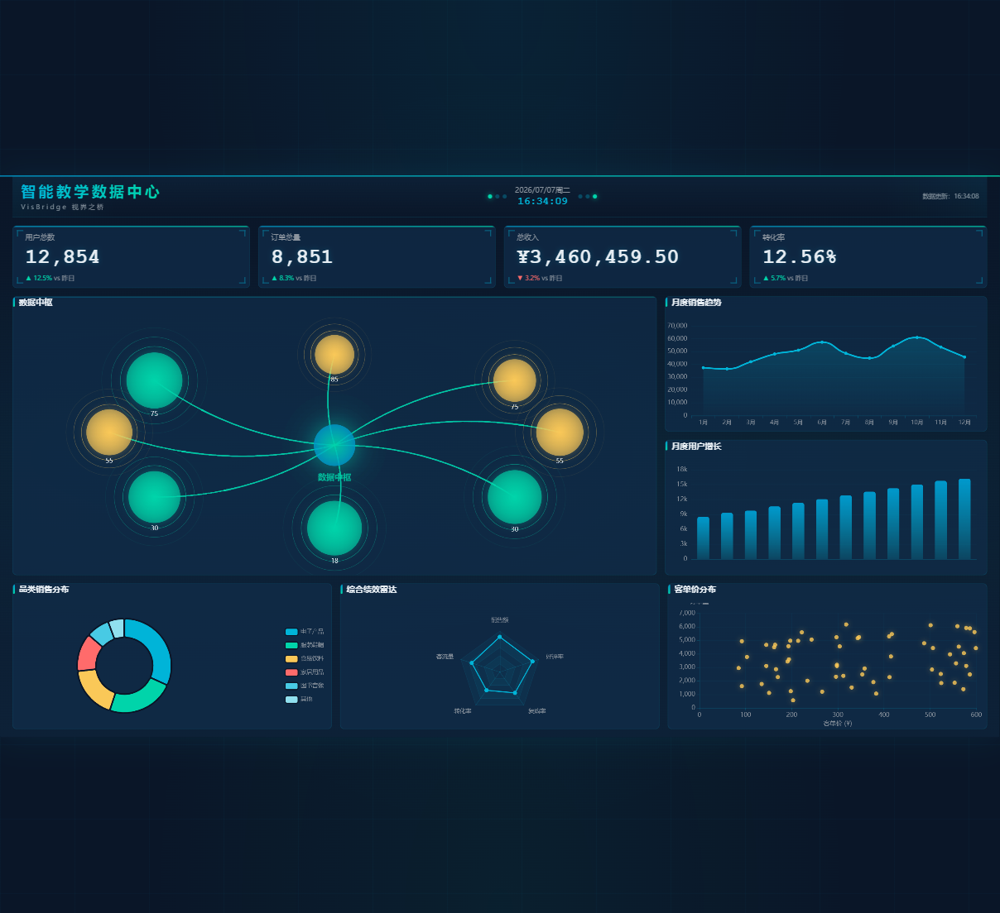

<p align="center">
  
</p>

<h1 align="center">
  
  
  
  
</h1>

# VisBridge · 视界之桥

> 数据连接视界，可视化搭建认知的桥梁。

**VisBridge** 是一个面向学生和初学者的**教学型数据可视化大屏**项目，旨在帮助学习者从 0 到 1 系统地理解并实践如何构建一个完整的数据大屏应用。

本项目的每一次迭代和每一条代码注释都以「教学呈现」为出发点——不堆砌概念，不过度工程化，让每一行代码都可读、可复现、可扩展。

---

## 项目亮点

| 维度 | 说明 |
|------|------|
| **从零构建** | 从 `npm create vite` 开始，逐步搭建到完整大屏交付 |
| **模拟真实业务** | 基于 MSW 的实时数据状态机，每 5 秒模拟业务数据波动 |
| **13 类可视化图表** | 中心枢纽态势图、折线、柱状、饼图、散点、雷达 + 实时指标卡 |
| **暗夜紫金视觉** | 深邃暗紫基底 + 紫罗兰高亮 + 琥珀鎏金点缀，奢华而高级 |
| **模块化工程** | TypeScript 类型约束、Pinia 状态管理、ECharts 封装复用 |
| **工程化体系** | ESLint + Prettier + Husky + commitlint + Vitest 完整配套 |

---

## 技术栈

| 类别 | 技术 | 版本 |
|------|------|------|
| 框架 | Vue 3 (Composition API) | ^3.4 |
| 语言 | TypeScript | ^5.4 |
| 构建 | Vite | ^5.2 |
| 状态管理 | Pinia | ^2.1 |
| 路由 | Vue Router | ^4.3 |
| 图表 | ECharts | ^5.5 |
| 数据模拟 | MSW (Mock Service Worker) | ^2.2 |
| 样式 | Less + CSS Variables | — |
| 测试 | Vitest + @vue/test-utils + happy-dom | ^1.5 |
| 代码规范 | ESLint + Prettier + Husky + commitlint | — |

---

## 快速开始

```bash
# 1. 克隆项目
git clone https://github.com/zangjeicy/VisBridge.git
cd VisBridge

# 2. 安装依赖
npm install

# 3. 启动开发服务器
npm run dev

# 4. 在浏览器中打开
# 访问 http://localhost:5173 即可看到大屏
```

> 项目默认启用 Mock 模式，无需后端即可运行。如需接入真实 API，修改 `src/api/request.ts` 中的 `USE_MOCK` 配置。

---

## 项目结构

```
VisBridge/
├── public/
│   └── mockServiceWorker.js    # MSW Service Worker
├── src/
│   ├── api/                    # API 接口层
│   │   ├── dashboard.ts        # 大屏数据接口
│   │   └── request.ts          # 请求封装（含 Mock/API 切换）
│   ├── components/
│   │   ├── charts/             # 图表组件
│   │   │   ├── HubOverviewChart.vue  # 中心枢纽态势图 ★
│   │   │   ├── LineChart.vue         # 折线图
│   │   │   ├── BarChart.vue          # 柱状图
│   │   │   ├── PieChart.vue          # 饼图
│   │   │   ├── RadarChart.vue        # 雷达图
│   │   │   └── ScatterChart.vue      # 散点图
│   │   └── common/             # 通用 UI 组件
│   │       ├── DataTime.vue          # 实时时间
│   │       ├── NumberCard.vue        # 指标卡片
│   │       └── SectionTitle.vue      # 区域标题
│   ├── composables/            # 组合式函数
│   │   ├── useDataRefresh.ts   # 自动刷新逻辑（5s 间隔）
│   │   └── useScreenScale.ts   # 16:9 自适应缩放
│   ├── layouts/
│   │   └── DashboardLayout.vue  # 大屏布局容器
│   ├── logger/
│   │   └── index.ts            # 日志系统
│   ├── mocks/
│   │   ├── browser.ts          # MSW 浏览器配置
│   │   └── handlers.ts         # Mock 数据 + 实时状态机
│   ├── router/
│   │   └── index.ts            # 路由配置
│   ├── stores/
│   │   └── dashboard.ts        # Pinia 大屏数据 Store
│   ├── styles/
│   │   ├── variables.less      # 暗夜紫金 CSS 变量
│   │   ├── reset.less          # 重置样式 + 科技网格背景
│   │   └── global.less         # 全局样式
│   ├── types/
│   │   ├── dashboard.ts        # 大屏类型定义
│   │   └── log.ts              # 日志类型
│   ├── utils/
│   │   ├── echarts.ts          # ECharts 主题 & 工具
│   │   └── format.ts           # 格式化工具
│   ├── views/
│   │   └── HomeView.vue        # 主大屏页面
│   ├── App.vue                 # 根组件
│   └── main.ts                 # 入口文件
├── package.json
├── tsconfig.json
├── vite.config.ts
├── vitest.config.ts
├── .eslintrc.cjs
├── .prettierrc.json
└── README.md
```

---

## 可用脚本

| 脚本 | 说明 |
|------|------|
| `npm run dev` | 启动 Vite 开发服务器 |
| `npm run build` | TypeScript 类型检查 + 生产构建 |
| `npm run preview` | 预览生产构建 |
| `npm run test` | 运行 Vitest 单元测试 |
| `npm run lint` | ESLint 代码检查 + 自动修复 |
| `npm run format` | Prettier 代码格式化 |

---

## 设计理念：暗夜紫金

整体视觉以「深邃暗紫 × 琥珀鎏金」为基线，兼具奢华感与科技感：

- **主背景**：暗紫 `#0f0b1e` / 深紫 `#1a1233`，叠加 60px 间距科技网格
- **主高亮**：紫罗兰 `#8b5cf6` / 淡紫 `#a78bfa` / 浅紫 `#c4b5fd`
- **辅助点缀**：琥珀 `#f59e0b` / 鎏金 `#fbbf24`，仅用于状态区分
- **面板装饰**：顶部渐变光带、四角窗棂角标、发光边框
- **中心枢纽**：紫色径向渐变脉冲节点 + 流光数据链路 + 涟漪效果
- **克制原则**：装饰服务于数据可读性，不做过度炫技

| 颜色色板 | 预览 |
|----------|------|
| 暗紫基底 | `#0f0b1e` `#1a1233` `#1e1638` |
| 紫罗兰高亮 | `#8b5cf6` `#a78bfa` `#c4b5fd` |
| 琥珀点缀 | `#f59e0b` |
| 鎏金告警 | `#fbbf24` |
| 危险红色 | `#ee6666` |

---

## 学习路线

本项目按以下模块逐步展开，适合按顺序学习：

1. **环境搭建** — Vite + Vue 3 + TypeScript 初始化，ESLint/Prettier/Husky 配置
2. **布局设计** — 16:9 大屏布局、`transform: scale` 自适应缩放
3. **数据层设计** — TypeScript 类型定义、MSW Mock 数据、Pinia Store
4. **基础图表** — 折线图、柱状图、饼图、散点图 + `observeResize`
5. **雷达图** — 多维指标 ECharts radar 实现
6. **中心枢纽图** — effectScatter + lines + scatter 组合，流光连线 + 脉冲节点
7. **实时数据模拟** — 模块级状态机 + 增量数据变化 + 自动刷新
8. **视觉统一** — CSS 变量主题系统、暗夜紫金整体升级
9. **测试编写** — Vitest + @vue/test-utils 单元测试
10. **生产构建** — TypeScript 类型检查 + Vite 打包优化

---

## 贡献指南

欢迎提交 Issue 和 Pull Request！

- Issue 请附带截图或错误日志
- PR 请遵循项目已有的代码风格（ESLint / Prettier 会自动检查）
- Commit 请遵循 [Conventional Commits](https://www.conventionalcommits.org/) 规范

---

## 开源协议

本项目基于 [MIT License](LICENSE) 开源，可自由使用、修改和分发。

---

<p align="center">
  <sub>VisBridge · 视界之桥 — 搭建你的数据视界之桥</sub>
</p>
